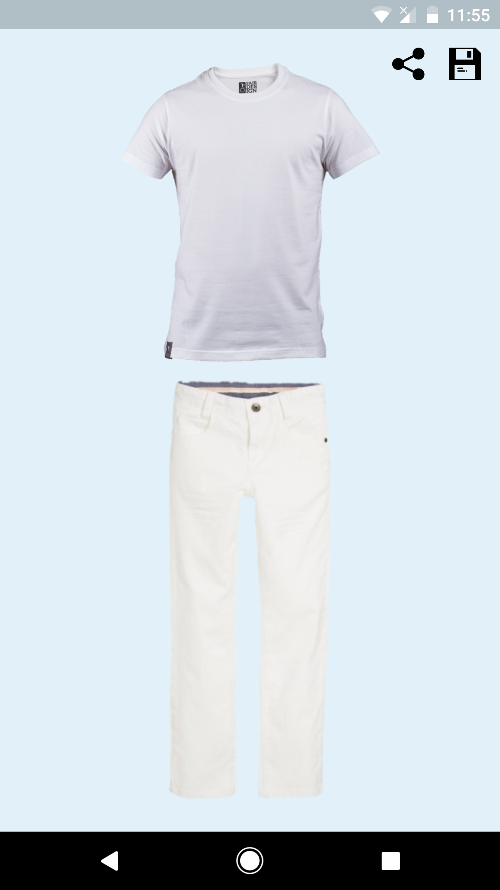
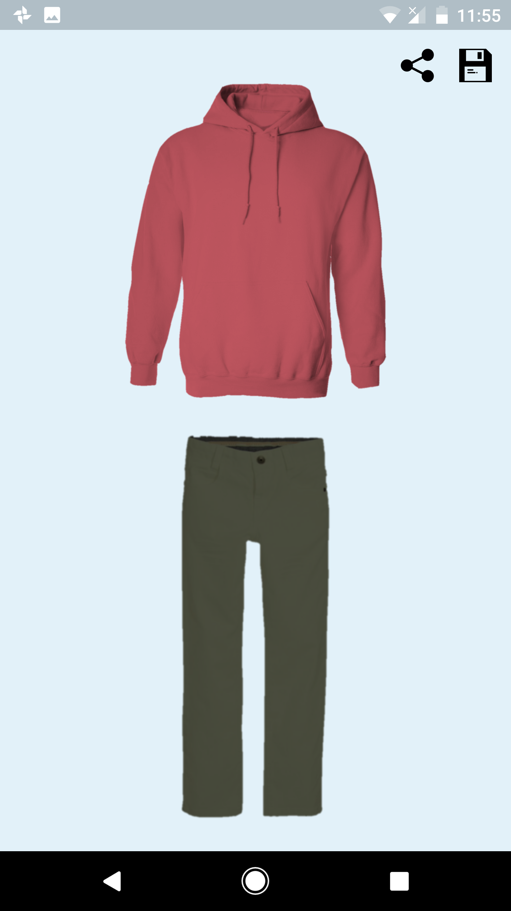
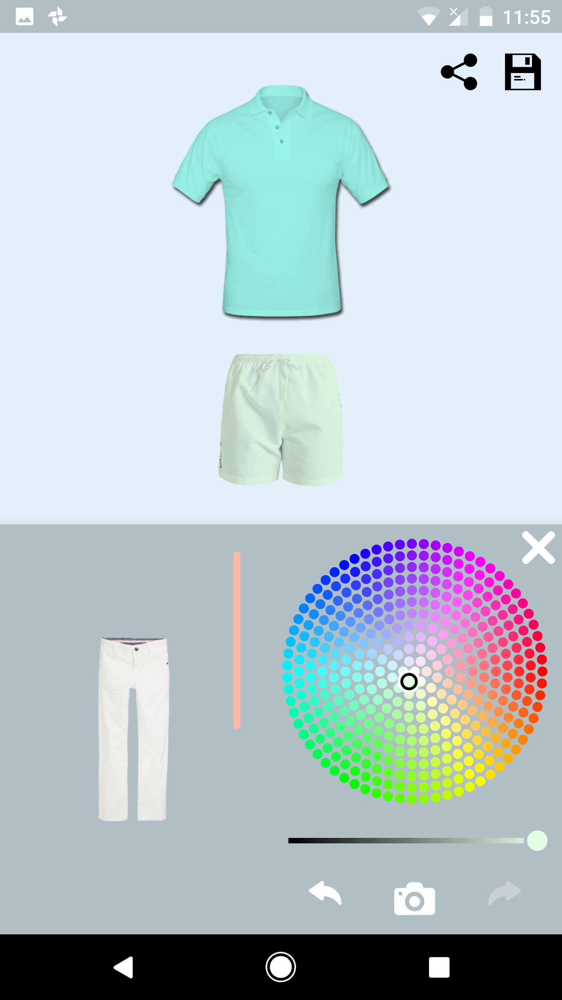

## Matchette
A clothing visualization application that allows users to select different styles and colors to find a preference that fits them

* [Compatible Platforms](#compatible-platforms)
* [Screenshots](#screenshots)
* [Installation Instructions](#installation-instructions)
* [Clothing Items](#clothing-items)
     * [Tops](#tops)
     * [Bottoms](#bottoms)
* [Contributing](#contributing)

     
## Compatible Platforms
  

## Screenshots
      

## Installation Instructions
The repository is an android studio project. We recommend using android studio's built-in VCS system. 
<ul>
    <li> Fork the repository
    <li> Open Android Studio. Click "Check out project from version control"
    <li> Create your token using github credentials. Select the forked repository 
    <li> Once the build is successful, run the app on an emulator connected device
</ul>

Alternatively, you can install the app directly using the actual apk. <a href="https://www.applivery.com/docs/troubleshooting/android-unknown-sources"> Make sure to allow apps from unknown sources</a>. The apk is avaible <href src="https://drive.google.com/drive/folders/1SI9y8lcyXGra462nVflLJ3CwNTB2eBrp">here</a>

## Clothing Items

### Tops
 Currently the following upper-body styles are available: 
 <ul>
  <li>Men's T-Shirt</li>
  <li>Women's T-Shirt</li>
  <li>Hoodie</li>
  <li>Men's Dress-Shirt</li>
  <li>Polo Shirt</li>
  <li>Long Sleeve T-Shirt</li>
  </ul>
  
 ### Bottoms
   Currently the following lower-body styles are available: 
   <ul>
  <li>Chino Pants</li>
  <li>Cotton Shorts</li>
  </ul>
  
 ## Contributing 
 Make sure to fork the repository. For any changes made, make a pull request that will be reviewed by the maintainers. 
